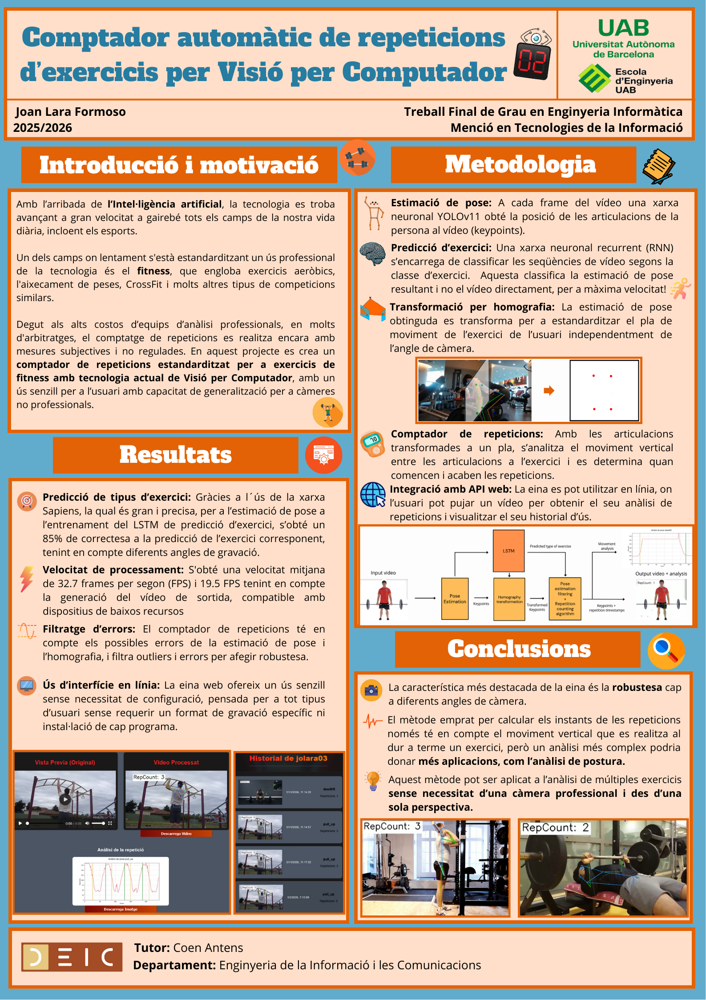

## Description

Computer Vision offers new tools that can add improvements and more precise analysis and refereeing to professional sports, with methods such as Pose Estimation and automatic action recognition. This project's objective is that from an exercise video uploaded to the web by the user, the developed tool is capable of identifying the exercise and counting the repetitions made. To recognize the user's action, a LSTM Network is utilized, trained by Meta's Sapiens Pose Estimation model. For repetition counting, YOLOv11 Pose Estimation is used, along with an homography transformation to adapt the camera's angle. The tool is accessible through a browser, and has been developed using a React frontend environment and a backend API FastAPI. The project's main feature is its robustness to the camera angle variation, that allows for an accurate counting with high tolerance to variations introduced by the user in the input video.

La Visió per Computador ofereix noves eines que poden aportar millores i més precisió d'anàlisi i arbitratge als esports professionals, amb mètodes com l'estimació de pose i el reconeixement automàtic d'accions. L'objectiu en aquest projecte és el d'a partir d'un vídeo d'exercici pujat a la web per l'usuari, l'eina desenvolupada sigui capaç de identificar l'exercici i comptar les repeticions que es realitzen. Per a reconèixer l'acció de l'usuari, s'utilitza una xarxa LSTM, entrenada amb el model Sapiens d'estimació de pose de Meta. Per al comptatge de repeticions s'utilitza Estimació de Pose amb YOLOv11 i una transformació per homografia per corregir la perspectiva de la càmera. La eina és accessible a través de un navegador, i aquesta ha estat desenvolupada en un entorn frontend React amb una API backend FastAPI. La característica principal en aquesta eina és la seva robustesa a la variació d'angle de gravació, que permet un comptatge precís amb una tolerància gran a les variacions introduïdes per l'usuari al vídeo d'entrada.

<p align="center">

</p>

<p align="center">

</p>

<p align="center">

</p>

<p align="center">

</p>

## Installation

```
git clone https://github.com/Yolopowah03/RepCount.git
cd RepCount
git lfs pull
```

### Backend

```
conda create -n python=3.10 --name repcount
conda activate repcount

pip install fastapi "uvicorn[standard]"
pip install uvicorn apscheduler pydantic[email] passlib python-jose python-multipart ultralytics argon2-cffi
conda install pytorch torchvision torchaudio pytorch-cuda=12.1 -c pytorch -c nvidia
```

### Frontend

```
conda create -n python=3.10 --name repcount_frontend
conda activate repcount_frontend

conda install nodejs=20 -c conda-forge -y

cd repCount_code/frontend_repCount
npm install
```

## Initialization

### Backend

```
python -m uvicorn repCount_code.backend_repCount.app.main:app --host=your_host1 --port=your_port1
```

### Frontend

```
cd repCount_code/frontend_repCount
npm run dev -- --port your_port2 --host
```

When using different your_host1 and your_port1, they must be updated in the frontend calls to the backend in /repCount_code/backend_repCount/app/main.py and in the .tsx files under /repCount_code/frontend_repCount/src

## 📁 Project structure

The main pipeline of the project can be found at ./repCount_code/repCount/repCount_YOLO11_web.py

```
.
├── documents # Paper, presentation and poster in PDF format with all submitted versions
├── exercise_dataset_seg # Dataset for training and testing YOLO11seg mask segmentation model
├── LSTM_dataset # Dataset for training and testing LSTM exercise classification model
├── models_exercise_seg # Trained YOLO11seg mask segmentation models
├── models_LSTM # Trained LSTM models for exercise classification
├── models_YOLO11_pose # Trained YOLO11pose pose extraction models
└── repCount_code
    ├── backend_repCount
    │   ├── app
    │   │  ├── core
    │   │  │   └── security.py # Backend web user session security functions
    │   │  ├── models
    │   │  │   │── schema.py # Model classes for backend web requests and responses
    │   │  │   └── user_model.py # Database classes for user management
    │   │  │── routers
    │   │  │   │── processing.py # Web endpoints for repetition counter and file download
    │   │  │   └── users.py # Web endpoints for user management
    │   │  │── services
    │   │  │   │── download_service.py # Web file download function
    │   │  │   └── user_service.py # User session management functions
    │   │  │
    │   │  ├── config.py # Backend web configuration parameters
    │   │  ├── main.py # Backend web startup and shutdown configuration
    │   │  └── utils.py # Backend web utility functions (temporary file cleanup)
    │   └── data # Web API database
    │
    ├── frontend_repCount
    │   └── src
    │       ├── assets # Default images to display on the web API
    │       ├── App.tsx/css # Index page
    │       ├── History.tsx/css # User usage history page
    │       ├── Login.tsx # User login page
    │       ├── main.tsx # Initial rendering page
    │       ├── Register.tsx # User registration page
    │       ├── User.css # User pages style configuration
    │       ├── UserProfile.tsx # User data page
    │       └── RepCount.tsx # Main page for repetition counter
    │
    ├── functions # Utility functions for managing directories and datasets
    │
    ├── Homography
    │   ├── affine_2D_mod.py # (Unused) Keypoint correspondence transformation for image displacement, adapted for web API
    │   ├── affine_2D.py # (Unused) Video transformation for keypoint correspondence by image displacement
    │   ├── homography.py # Video transformation for keypoint correspondence by homography, adapted for web API
    │   └── homography_mod.py # Keypoint correspondence transformation by homography, adapted for web API
    │
    ├── LSTM
    │   ├── predict_LSTM.py # Script to infer on a directory with LSTM exercise classifier
    │   ├── predict_LSTM_mod.py # Script for automatic inference with LSTM classifier on each execution from the web API
    │   └── predict_LSTM.py # LSTM classifier training script
    │
    ├── repCount
    │   ├── repCount_Sapiens.py # Full pipeline execution script on a video using poses inferred by Sapiens model
    │   ├── repCount_YOLO11.py # Full pipeline execution script on a video using poses inferred by YOLO11pose model
    │   └── repCount_YOLO11_web.py # Full pipeline execution script from the web API using poses inferred by YOLO11pose model
    │
    ├── Sapiens_Pose
    │   ├── predict_pose.sh # Script to infer with Sapiens and build LSTM dataset
    │   └── keypoint_guide.txt # Sapiens keypoint index guide (COCO 17 format)
    │
    ├── YOLO_pose
    │   ├── predict_YOLO11_pose.py # Code to infer on an image directory with YOLO11seg
    │   └── predict_YOLO11_mod.py # Code for automatic inference with YOLO11seg on each execution from the web API
    │
    └── YOLO11seg
        ├── YOLO11seg_predict_exercise.py # Code to infer with YOLO11seg
        └── YOLO11seg_train_eval_exercise.py # Code to train YOLO11seg


```

Joan Lara Formoso - Autonomous University of Barcelona
