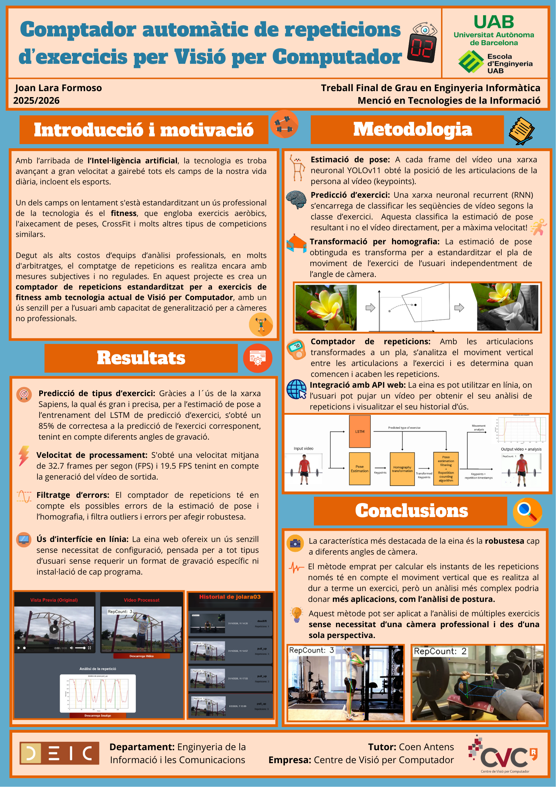
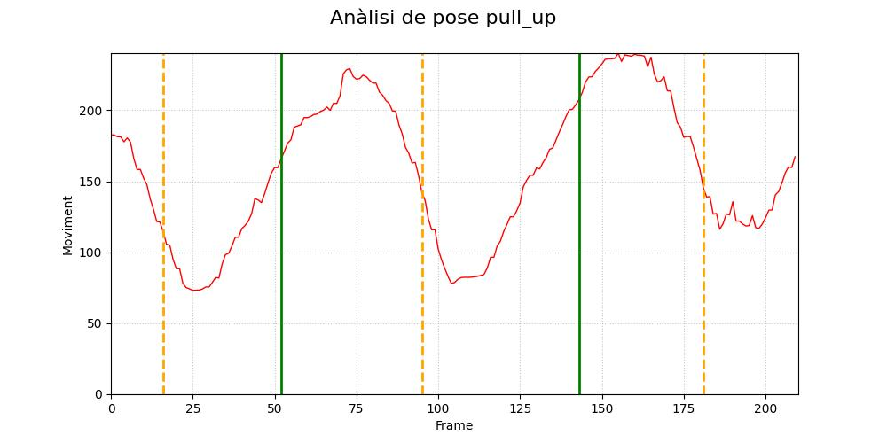

## Descripció

La Visió per Computador ofereix noves eines que poden aportar millores i més precisió d'anàlisi i arbitratge als esports professionals, amb mètodes com l'estimació de pose i el reconeixement automàtic d'accions. L'objectiu en aquest projecte és el d'a partir d'un vídeo d'exercici pujat a la web per l'usuari, l'eina desenvolupada sigui capaç de identificar l'exercici i comptar les repeticions que es realitzen. Per a reconèixer l'acció de l'usuari, s'utilitza una xarxa LSTM, entrenada amb el model Sapiens d'estimació de pose de Meta. Per al comptatge de repeticions s'utilitza Estimació de Pose amb YOLOv11 i una transformació per homografia per corregir la perspectiva de la càmera. La eina és accessible a través de un navegador, i aquesta ha estat desenvolupada en un entorn frontend React amb una API backend FastAPI. La característica principal en aquesta eina és la seva robustesa a la variació d'angle de gravació, que permet un comptatge precís amb una tolerància gran a les variacions introduïdes per l'usuari al vídeo d'entrada.

Computer Vision offers new tools that can add improvements and more precise analysis and refereeing to professional sports, with methods such as Pose Estimation and automatic action recognition. This project's objective is that from an exercise video uploaded to the web by the user, the developed tool is capable of identifying the exercise and counting the repetitions made. To recognize the user's action, a LSTM Network is utilized, trained by Meta's Sapiens Pose Estimation model. For repetition counting, YOLOv11 Pose Estimation is used, along with an homography transformation to adapt the camera's angle. The tool is accessible through a browser, and has been developed using a React frontend environment and a backend API FastAPI. The project's main feature is its robustness to the camera angle variation, that allows for an accurate counting with high tolerance to variations introduced by the user in the input video.

<p align="center">

</p>

<p align="center">

</p>

<p align="center">

</p>

<p align="center">

</p>

## Inicialització

### Backend

uvicorn repCount_code.backend_repCount.app.main:app --host=0.0.0.0 --port=8080

### Frontend

cd repCount_code/frontend_repCount
npm run dev -- --port 8079 --host

## 📁 Estructura del projecte

El pipeline principal del projecte es pot trobar a ./repCount_code/repCount/repCount_YOLO11_web.py

```
.
├── documents # Paper, presentació i pòster en format PDF amb totes les seves versions entregades
├── exercise_dataset_seg # Dataset per a entrenament i prova de model de segmentació de màscara YOLO11seg
├── LSTM_dataset # Dataset per a entrenament i prova de model LSTM de classificació d'exercici
├── models_exercise_seg # Models entrenats de segmentació de màscara YOLO11seg
├── models_LSTM # Models entrenats LSTM per a classificació d'exercici
├── models_YOLO11_pose # Models entrenats d'extracció de pose YOLO11pose
├── sapiens # Carpeta de instal·lació de model d'extracció de pose Sapiens
└── repCount_code
    ├── backend_repCount
    │   ├── app
    │   │  ├── core
    │   │  │   └── security.py # Funcions de seguretat de sessió d'usuari backend web
    │   │  ├── models
    │   │  │   │── schema.py # Classes model per a requests i responses backend web
    │   │  │   └── user_model.py # Classes base de dades per a gestió de l'usuari
    │   │  │── routers
    │   │  │   │── processing.py # Endpoints web per al comptador de repeticions i la descàrrega d'arxius
    │   │  │   └── users.py # Endpoints web per a la gestió de l'usuari
    │   │  │── services
    │   │  │   │── download_service.py # Funció per a la descàrrega d'arxius web
    │   │  │   └── user_service.py # Funcions per a la gestió de la sessió d'usuari
    │   │  │
    │   │  ├── config.py # Paràmetres de configuració backend web
    │   │  ├── main.py # Configuració d'arrancada i aturada backend web
    │   │  └── utils.py # Funcions útils backend web (neteja temporal d'arxius)
    │   └── data # Base de dades API web
    │
    ├── frontend_repCount
    │   └── src
    │       ├── assets # Imatges predeterminades per a mostrar a l'API web
    │       ├── App.tsx/css # Pàgina de indexació
    │       ├── History.tsx/css # Pàgina de historial d'ús del usuari
    │       ├── Login.tsx # Pàgina de inici de sessió de l'usuari
    │       ├── main.tsx # Pàgina de renderització inicial
    │       ├── Register.tsx # Pàgina de registre de l'usuari
    │       ├── User.css # Configuració d'estil de les pàgines de l'usuari
    │       ├── UserProfile.tsx # Pàgina de dades de l'usuari
    │       └── RepCount.tsx # Pàgina principal per al comptador de repeticions
    │
    ├── functions # Funcions d'utilitat per a gestionar directoris i datasets
    │
    ├── Homography
    │   ├── affine_2D_mod.py # (Sense Usar) Transformació per a correspondència de keypoints per desplaçament d'imatge, adaptada a API web
    │   ├── affine_2D.py # (Sense Usar) Transformació sobre un vídeo per a correspondència de keypoints per desplaçament d'imatge
    │   ├── homography.py # Transformació sobre un vídeo per a correspondència de keypoints per homografia, adaptada a API web
    │   └── homography_mod.py # Transformació per a correspondència de keypoints per homografia, adaptada a API web
    │
    ├── LSTM
    │   ├── predict_LSTM.py # Script per a inferir a un directory amb classificador d'exercicis LSTM
    │   ├── predict_LSTM_mod.py # Script per a inferir de forma automàtica amb el classificador LSTM a cada execució des de la API web.
    │   └── predict_LSTM.py # Script d'entrenament classificador LSTM
    │
    ├── repCount
    │   ├── repCount_Sapiens.py # Script d'execució del pipeline complet sobre un vídeo utilitzant poses inferides pel model Sapiens
    │   ├── repCount_YOLO11.py # Script d'execució del pipeline complet sobre un vídeo utilitzant poses inferides pel model YOLO11pose
    │   └── repCount_YOLO11_web.py # Script d'execució del pipeline complet desde la API web utilitzant poses inferides pel model YOLO11pose
    │
    ├── Sapiens_Pose
    │   ├── predict_pose.sh # Script per a inferir amb Sapiens i construir dataset LSTM
    │   └── keypoint_guide.txt # Guia de indexos de keypoints Sapiens (format COCO 17)
    │
    ├── YOLO_pose
    │   ├── predict_YOLO11_pose.py # Codi per a inferir en un directori d'imatges amb YOLO11seg
    │   └── predict_YOLO11_mod.py # Codi per a inferir de forma automàtica amb YOLO11seg a cada execució des de la API web.
    │
    └── YOLO11seg
        ├── YOLO11seg_predict_exercise.py # Codi per a inferir amb YOLO11seg
        └── YOLO11seg_train_eval_exercise.py # Codi per a entrenar YOLO11seg


```

Joan Lara Formoso - Universitat Autònoma de Barcelona
